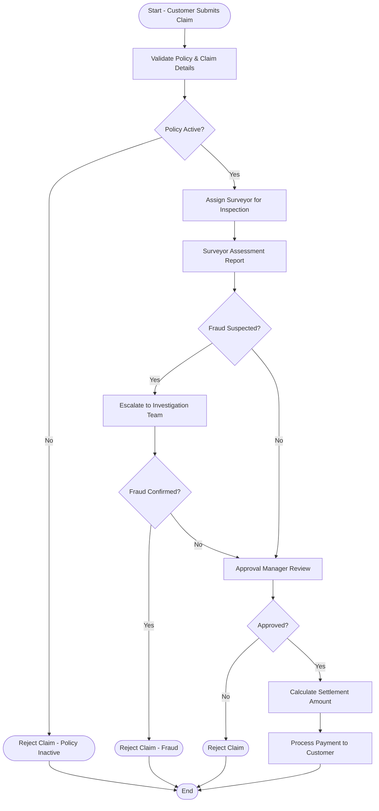
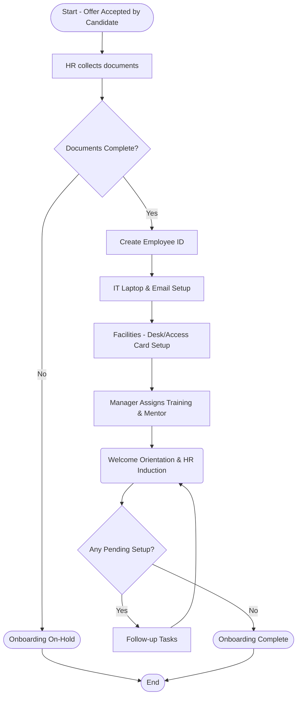

# Business Process Documentation with Mermaid Diagrams

## Process Diagram 3 — Insurance Claim Processing
**Goal:** Approve or Reject insurance claim & settle payment  
**Domain:** Banking / Insurance

### Participants
- Customer
- Claim Processor
- Surveyor / Investigator
- Approval Manager
- System (Policy Validation + Fraud Check)

### Mermaid Workflow

---

## Process Diagram 4 — Employee Onboarding Process
**Goal:** Provide smooth joining experience & activate employee for work  
**Domain:** HR / Corporate

### Participants
- New Employee
- HR Team
- IT Team
- Admin (Facilities)
- Manager

### Mermaid Workflow

