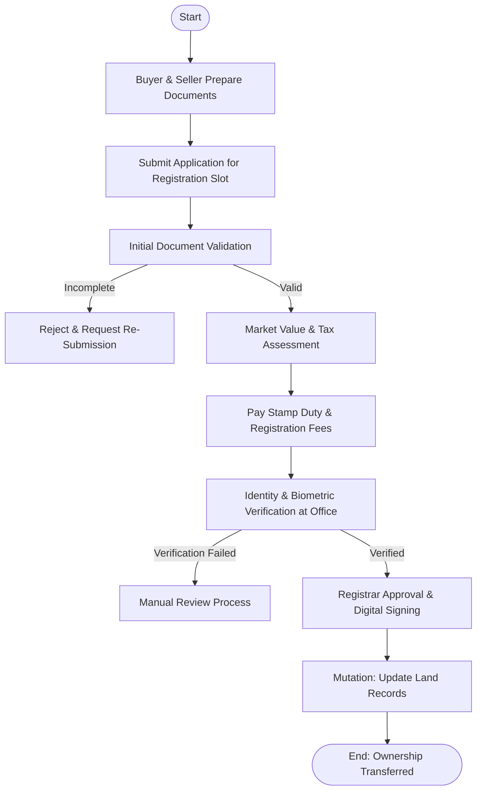

# 🏠 Government Sector — Property Registration Process

## ✅ Process Overview
Complete legal documentation to transfer property ownership between seller and buyer while ensuring tax/fee compliance and legal records update in government systems.

---

## 🎯 Process Goal
To legally register property ownership and update government land records ensuring transparency and avoidance of disputes.

---

## 👥 Participants (Users / Roles)
| Role | Responsibility |
|------|----------------|
| Buyer / Seller | Provide property & identity details |
| Registration Clerk | Initial document validation & scheduling |
| Document Writer / Advocate | Draft sale deed |
| Sub-Registrar Officer | Verify and approve registration |
| Government Valuation Department | Validate market value |
| Revenue/Land Records Officer | Update ownership details in land records |
| Payment Department | Collect stamp duty & registration fee |

---

## 📌 Business Process Steps
1. Buyer & seller prepare property documents  
2. Apply online/offline for registration slot  
3. Preliminary document validation  
4. Market value & tax assessment  
5. Payment of stamp duty & registration fees  
6. In-person verification (biometrics, photographs)  
7. Registrar approves sale deed & signs digitally  
8. Mutation request initiated to update land records  
✅ Ownership transfer completed  

---

## 🔀 Key Decisions / Routing
| Decision | Route A | Route B |
|----------|---------|---------|
| Property Documentation Complete? | Proceed | Reject & Re-Submit |
| Payment Verified? | Continue | Hold registration |
| Identity Verified? | Approve Registration | Manual Review |

---

## ✅ Mermaid Flowchart — Property Registration Process

---

## 🌍 Real-Time Scenario (India)
Buyer and seller visit Sub-Registrar Office → Biometric verification  
E-Seva / Registration portal used for:  
- Slot booking  
- Stamp duty payment  

After approval → **Dharani / Mee Bhoomi** portal updated for land records  

✅ Government uses workflow systems to ensure:  
✔ No duplicate land claims  
✔ Revenue properly collected  
✔ Identity verification through Aadhaar  

---

## 🛠️ Documents Required (Artifacts)
- Sale Deed  
- Encumbrance Certificate (EC)  
- Property Tax Receipts  
- ID Proofs (Aadhaar, PAN)  
- Market Value Assessment Slip  
- Biometric Proof  

---

## 💡 Workflow Automation in FileNet or BPM Tools
| Feature | Usage |
|--------|-------|
| Work Items | Route for validation/approval |
| Integration | Payment gateway, land record systems |
| Document Management | Store sale deed & identity docs |
| Audit Logs | Legal compliance for approvals |
