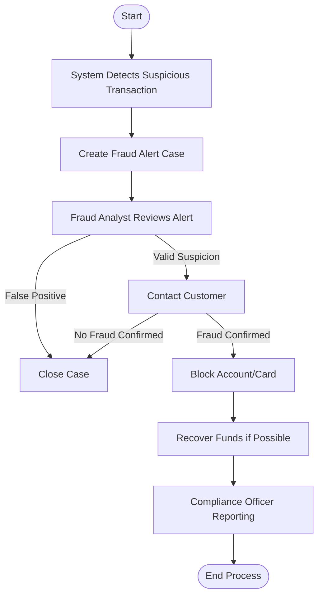

# 🕵️‍♂️ Fraud Detection Case Handling — Business Process Documentation

## ✅ Process Overview
Fraud Detection Case Handling involves identifying suspicious activities in financial transactions, validating fraud alerts, investigating issues, and taking corrective actions to protect customers and the organization.

---

## 🎯 Process Goal
To detect, investigate, and mitigate fraudulent activities to prevent financial loss and ensure customer trust.

---

## 🧩 Key Participants (Users / Roles)
| Role / Participant | Responsibility |
|------------------|----------------|
| Fraud Monitoring System | Detects suspicious patterns and triggers alerts |
| Fraud Analyst | Reviews alerts, investigates anomalies |
| Customer Service Executive | Contacts customers, collects additional information |
| Compliance Officer | Ensures regulatory actions and reporting |
| Account Manager | Helps manage account actions/recovery |
| Risk Manager | Approves escalated decisions (block accounts, legal actions) |

---

## 🔁 Business Process Steps / Activities
1. System detects suspicious transaction  
2. Create alert (case initiated)  
3. Fraud Analyst reviews alert  
4. Decision: False Positive or Valid Suspicion?  
   - If false positive → Close case  
   - If valid suspicion → Proceed with investigation  
5. Contact customer for confirmation  
6. Decision: Customer confirms or denies?  
   - If denied → Close case  
   - If confirmed → Take action  
7. Block card/account temporarily  
8. Recover funds (if possible)  
9. File compliance report  
10. Close case after completion of corrective actions  

---

## 🔀 Decision Points & Routes
| Decision | Option A → Route | Option B → Route |
|----------|-----------------|----------------|
| Suspicious Activity Valid? | Yes → Investigation | No → Close Case |
| Customer Confirms Fraud? | Yes → Block Account + Recovery | No → Close Case |

---

## ✅ Mermaid Flowchart: Fraud Detection Case Handling

---

## 📌 Real-Time Scenario (Banking Fraud)
A credit card user usually spends ₹2,000–₹5,000 per month only in Hyderabad.  
Suddenly a ₹50,000 purchase occurs in Dubai at 2 AM.  
System flags this as high-risk transaction → Alert triggered  
Customer confirms they never traveled abroad  
✅ Bank blocks the card immediately and initiates refund procedure → *Fraud prevented*

---

## 💡 Where BPM is used in Fraud Detection?
| Tool/Technology | Purpose |
|----------------|---------|
| FileNet Process Engine | Case creation, routing decisions |
| IBM BAW / Camunda | Process automation, escalations |
| ML Models | Detect patterns & anomalies |
| RPA Bots | Perform background checks |

---

## ✅ Artifacts Used
- Case reports  
- Customer verification logs  
- Financial transaction logs  
- Compliance regulatory filing  
