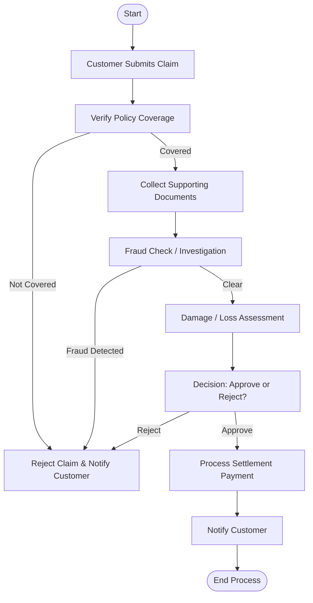

# 🏥 Insurance Claim Processing — Business Process Documentation

## ✅ Process Overview
Insurance Claim Processing ensures customers receive compensation for damages, accidents, or medical treatments as per policy terms.

---

## 🎯 Process Goal
To verify, evaluate, and settle claims accurately while preventing fraud and ensuring customer satisfaction.

---

## 👥 Participants (Roles / Users)
| Role | Responsibility |
|------|----------------|
| Policyholder (Customer) | Submits claim with documents |
| Claim Intake Agent | Registers & validates basic details |
| Claims Adjuster / Investigator | Inspects damages & authenticity |
| Medical Provider / Service Center | Provides supporting records |
| Underwriter | Checks policy coverage & exclusions |
| Claims Manager | Approves high-value or disputed cases |
| Finance Team | Processes final payment |

---

## 📌 Business Process Steps
1. Claim request submitted by customer  
2. Document collection  
3. Validate policy coverage  
4. Fraud check / Investigation if needed  
5. Risk assessment & damage estimation  
6. Decision point: Approve / Reject  
7. If approved → Settlement processing  
8. Customer notified and case closure  

---

## 🔀 Decision Points & Routing
| Decision | Route A | Route B |
|----------|---------|---------|
| Policy Active & Coverage Valid? | Proceed with assessment | Reject Claim |
| Fraud Suspected? | Start Investigation | Continue Normal Flow |
| Final Approval? | Release Payment | Reject Claim |

---

## ✅ Mermaid Flowchart — Insurance Claim Processing

---

## 🎯 Real-Time Scenarios
| Scenario | Example |
|----------|---------|
| Health Insurance | Hospital uploads bills → claim settled directly |
| Vehicle Accident Claim | Accident → adjuster visit → inspection photos → payout |
| Life/Term Insurance | Death certificate → nominee validation → payout release |

---

## 🛠️ Artifacts (Documents / Data)
- Policy Details  
- FIR/Incident Report (Vehicle Claims)  
- Medical Bills & Records (Health)  
- Survey/Inspection Report  
- Approval Logs  
- Payment Receipts  

---

## 🔗 How this maps with FileNet / Workflow Automation
| FileNet Component | Usage in Process |
|------------------|-----------------|
| Work Items | Claim case routing to roles |
| Queues | Claim Intake / Fraud / Approval queues |
| ACL & Roles | Role-based review & approvals |
| Process Diagrams | Workflow automation |
| Case Management | Related docs & tasks under one case |
