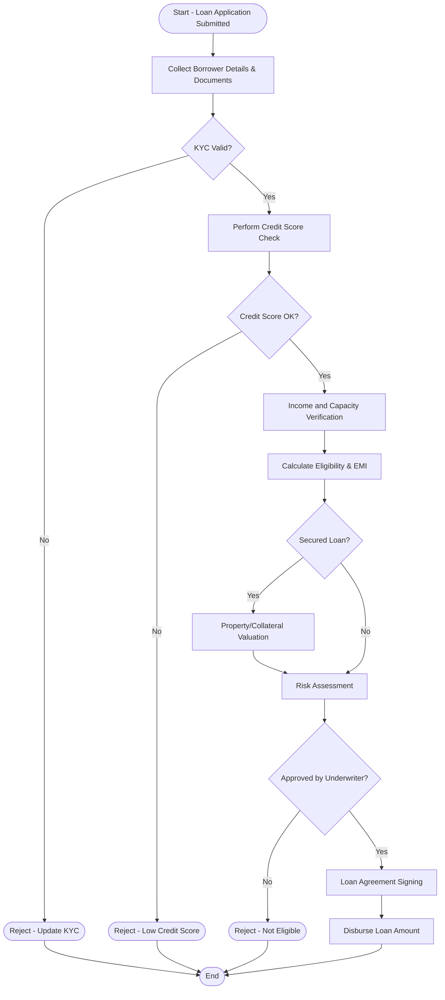

# 🏦 Loan Approval Process — Detailed Documentation

## 🎯 Process Goal
Evaluate a loan application and Approve / Reject it based on eligibility, creditworthiness, and risk policies.

## 🏢 Domain
Banking / Finance

---

## 👥 Participants (Roles & Responsibilities)
| Role | Responsibility |
|------|----------------|
| Customer | Submits loan application |
| Loan Officer | Collects details, performs KYC |
| Credit Team | Financial evaluation |
| Risk Team | Risk assessment for high-value loans |
| Underwriter | Final approval |
| Core Banking System | Eligibility checks & automation |

---

## ✅ Steps / Activities
1. Customer submits loan application online or at branch  
2. Document submission & KYC verification  
3. Credit Bureau score check  
4. Income proof verification  
5. Loan eligibility calculation  
6. Property / Asset valuation if applicable  
7. Risk team approval for large loans  
8. Final approval by underwriting  
9. Loan agreement signing  
10. Disbursement of funds  

---

## ❓ Decision Points
| Decision | Trigger | Outcome |
|---------|---------|--------|
| KYC Valid? | Missing/Expired ID | Reject/Hold |
| Credit score ≥ threshold? | Low credit history | Reject |
| Income sufficient to repay? | High DTI ratio | Reject / adjust loan amount |
| Risk review needed? | Loan amount > preset limit | Extra approval |

---

## 🔀 Routing
| Condition | Route |
|----------|-------|
| Normal case | Loan Officer → Credit Team → Underwriter |
| High-risk case | Loan Officer → Credit → Risk Team → Underwriter |

---

## 🧾 Required Documents
- Identity Proof (Aadhar, PAN)
- Address Proof
- Income Proof (Salary slips, IT returns)
- Bank Statements (6–12 months)
- Collateral Papers (if secured loan)

---

## 🧮 Calculations (System Tasks)
| Task | Action Type |
|------|-------------|
| Credit score fetch (CIBIL/Equifax) | ✅ Automated |
| Loan EMI working | ✅ Automated |
| Loan-to-Value Ratio | ✅ Automated |
| Debt-to-Income Ratio | ✅ Automated |
| Final Approval | 🧑‍💼 Manual decision |

---

## 📦 Outputs / End Results
| Outcome | Description |
|--------|-------------|
| ✅ Approved | Loan account created + disbursement |
| ❌ Rejected | Rejection reason communicated |

---

## 📊 Mermaid Diagram — Loan Approval Workflow

---

## 🏦 Real-Time Scenario — FileNet PE Mapping
| Process Action | FileNet Object |
|----------------|----------------|
| Application created | Work Item generated in Loan Initiation Queue |
| Document validation | Step requiring manual completion |
| Risk approval | Parallel workflow branch |
| Agreement signed | System step → metadata updated |
| Disbursement | Workflow end system action |

---

## 🔔 SLA Alerts
- Credit check must complete within 2 hours
- Risk approval within 1 business day

📌 Audit logs maintained for all decisions

---

## ✅ Summary Table
| Feature | Banking Requirement |
|---------|--------------------|
| Compliance | KYC, AML, RBI guidelines |
| Risk | Score + Income + Asset value |
| Customer Notification | SMS/Email + Branch call |
| Document Storage | CE Repository (PDF + metadata) |
