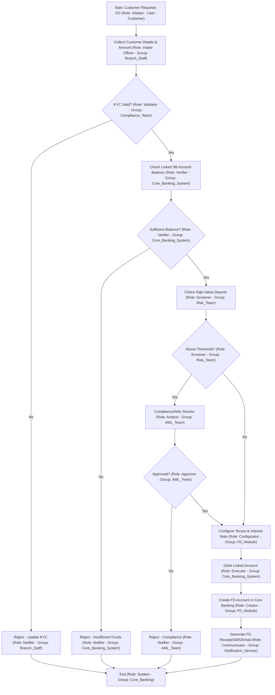

# 🏦 Fixed Deposit (FD) Opening Process

## 🎯 Process Goal
Successfully open a Fixed Deposit account and generate FD receipt for customer.

## 🏢 Domain
Banking / Financial Services

## 👥 Participants (Roles & Swimlanes)
| Role | Responsibility |
|------|----------------|
| Customer | Requesting FD |
| Relationship Manager (RM) / Bank Teller | Collects details & initiates FD |
| Backend Operations | Verification & account linking |
| Core Banking System | Auto interest & maturity computation |
| Compliance / Risk Team | Checks AML, KYC |

---

## ✅ Detailed Process Flow
1. Customer requests FD with deposit amount & tenure
2. KYC & existing account validation
3. Check source of funds
4. Interest rate selection based on tenure / senior citizen
5. Block funds from linked account
6. FD account creation
7. FD certificate/receipt generation
8. Notify customer via SMS/Email

---

## 🔀 Decisions
- KYC valid or not
- Sufficient balance or not
- High-value deposit → Compliance review

---

## 📦 Process Outcomes
✅ FD created successfully  
❌ FD request rejected (reason documented)

---

## 📊 Mermaid Workflow Diagram

 Fixed Deposit (FD) Process Flow – Explained
- Start – Customer Requests FD
The process begins when a customer initiates a request to open a Fixed Deposit.
- Collect Customer Details & Amount
Capture essential information such as customer ID, deposit amount, and desired tenure.
- KYC Valid?
Check if the customer's Know Your Customer (KYC) details are up to date.
- No → Reject the request and prompt the customer to update KYC → End
- Yes → Proceed to the next step
- Check Linked Savings Account Balance
Verify if the linked savings account has enough funds to cover the FD amount.
- Sufficient Balance?
- No → Reject the request due to insufficient funds → End
- Yes → Continue
- Check High-Value Deposit
Determine if the deposit amount exceeds a predefined threshold (e.g., ₹10 lakh or regulatory limit).
- Above Threshold?
- Yes → Trigger a Compliance/AML (Anti-Money Laundering) Review
- Approved?
- No → Reject the request due to compliance concerns → End
- Yes → Proceed
- No → Skip compliance review and continue
- Configure Tenure & Interest Rate
Based on the deposit duration and customer type (e.g., senior citizen), assign the applicable interest rate.
- Debit Linked Account
Deduct the FD amount from the customer’s savings account.
- Create FD Account in Core Banking
Set up the FD account in the core banking system with all relevant details.
- Generate FD Receipt / SMS / Email
Create the FD certificate and send confirmation to the customer via SMS and/or email.
- End
The FD creation process is complete.

---

## 🌍 Real-Time Scenario (FileNet Perspective)
| Step | FileNet Workflow Object |
|------|------------------------|
| Customer request routed to Branch Teller | Work item in Queue |
| KYC status task | Step requiring approval |
| Compliance review (if needed) | Subprocess / Workflow fork |
| Final approval | System auto-complete step |
| Document storage | CE stores FD contract + acknowledgement |

---

## ⚙️ SLA/Timers
- Compliance team → must approve within 4 hours
- Funds blocking → immediate system task

---

## 🔔 Event Notifications
- Assignment notifications
- Auto-escalation if SLA breached

---

# 🗂️ Key Workflow Properties for FD Creation

## 🧑 Customer Details
- `customerId` – Unique identifier for the customer  
- `customerName` – Full name of the applicant  
- `dateOfBirth` – Used to determine senior citizen status  
- `kycStatus` – Indicates if KYC is valid or needs update  
- `linkedAccountNumber` – Savings account used for funding the FD  

## 💰 Deposit Information
- `depositAmount` – Amount to be placed in the FD  
- `tenureMonths` – Duration of the FD in months  
- `interestRate` – Applicable rate based on tenure and customer type  
- `isSeniorCitizen` – Boolean flag to apply special interest rates  
- `depositThresholdFlag` – Indicates if deposit exceeds compliance threshold  

## 🔍 Validation & Compliance
- `balanceAvailable` – Current balance in linked account  
- `isHighValueDeposit` – Boolean flag for AML screening  
- `complianceStatus` – Result of AML/compliance review  
- `sourceOfFunds` – Optional field for audit/compliance  

## 🏦 FD Account Setup
- `fdAccountNumber` – Newly created FD account number  
- `fdStartDate` – Date of FD creation  
- `fdMaturityDate` – Calculated based on tenure  
- `fdStatus` – Active, Rejected, or Pending  

## 📢 Notification & Receipt
- `receiptNumber` – FD certificate or receipt ID  
- `notificationChannel` – SMS, Email, or Both  
- `notificationStatus` – Sent, Failed, or Pending  

## ⚙️ System Metadata
- `workflowStatus` – Current stage (e.g., Initiated, Validated, Completed)  
- `initiatedBy` – Role or user who started the request  
- `rejectionReason` – If applicable (e.g., KYC invalid, insufficient funds)  
- `timestamp` – For audit trail and tracking  

## 📝 Summary Table
| Feature | Banking Use |
|---------|-------------|
| Automatic interest payout | Monthly/Quarterly |
| Tax considerations | TDS on interest |
| Maturity workflow | Auto-renewal or payout process |

---

## ✅ Output Artifacts
📌 FD Acknowledgement Receipt  
📌 FD Terms & Conditions  
📌 Maturity Calendar Entry in CBS
