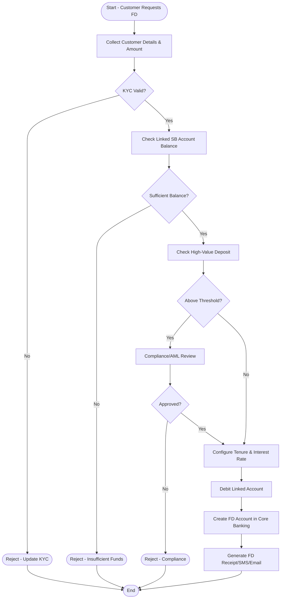

# 🏦 Fixed Deposit (FD) Opening Process

## 🎯 Process Goal
Successfully open a Fixed Deposit account and generate FD receipt for customer.

## 🏢 Domain
Banking / Financial Services

## 👥 Participants (Roles & Swimlanes)
| Role | Responsibility |
|------|----------------|
| Customer | Requesting FD |
| Relationship Manager (RM) / Bank Teller | Collects details & initiates FD |
| Backend Operations | Verification & account linking |
| Core Banking System | Auto interest & maturity computation |
| Compliance / Risk Team | Checks AML, KYC |

---

## ✅ Detailed Process Flow
1. Customer requests FD with deposit amount & tenure
2. KYC & existing account validation
3. Check source of funds
4. Interest rate selection based on tenure / senior citizen
5. Block funds from linked account
6. FD account creation
7. FD certificate/receipt generation
8. Notify customer via SMS/Email

---

## 🔀 Decisions
- KYC valid or not
- Sufficient balance or not
- High-value deposit → Compliance review

---

## 📦 Process Outcomes
✅ FD created successfully  
❌ FD request rejected (reason documented)

---

## 📊 Mermaid Workflow Diagram

---

## 🌍 Real-Time Scenario (FileNet Perspective)
| Step | FileNet Workflow Object |
|------|------------------------|
| Customer request routed to Branch Teller | Work item in Queue |
| KYC status task | Step requiring approval |
| Compliance review (if needed) | Subprocess / Workflow fork |
| Final approval | System auto-complete step |
| Document storage | CE stores FD contract + acknowledgement |

---

## ⚙️ SLA/Timers
- Compliance team → must approve within 4 hours
- Funds blocking → immediate system task

---

## 🔔 Event Notifications
- Assignment notifications
- Auto-escalation if SLA breached

---

## 📝 Summary Table
| Feature | Banking Use |
|---------|-------------|
| Automatic interest payout | Monthly/Quarterly |
| Tax considerations | TDS on interest |
| Maturity workflow | Auto-renewal or payout process |

---

## ✅ Output Artifacts
📌 FD Acknowledgement Receipt  
📌 FD Terms & Conditions  
📌 Maturity Calendar Entry in CBS
