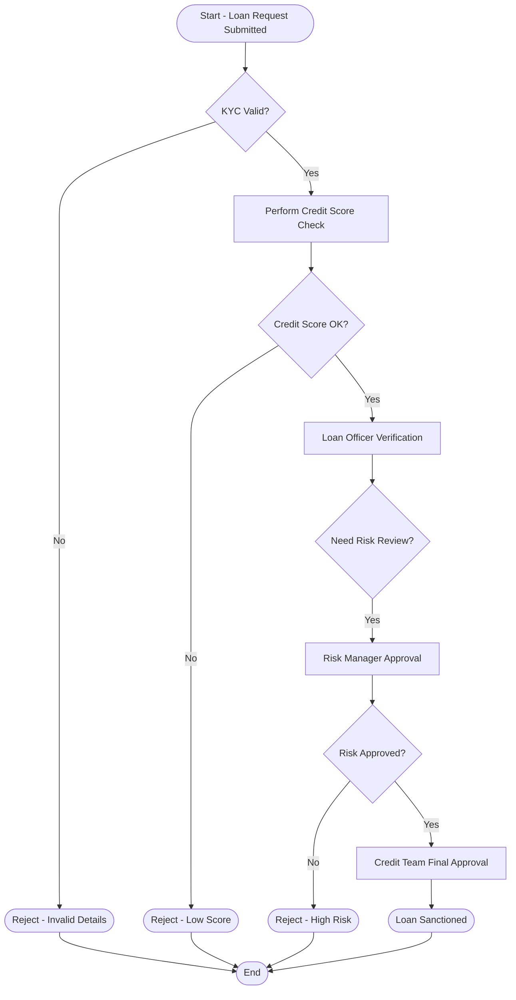
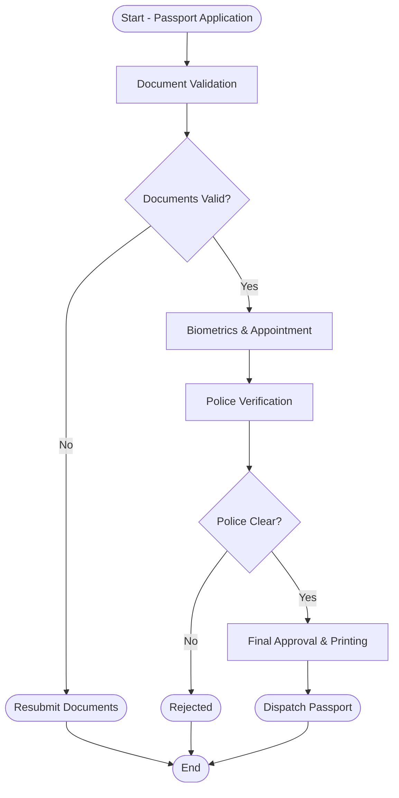
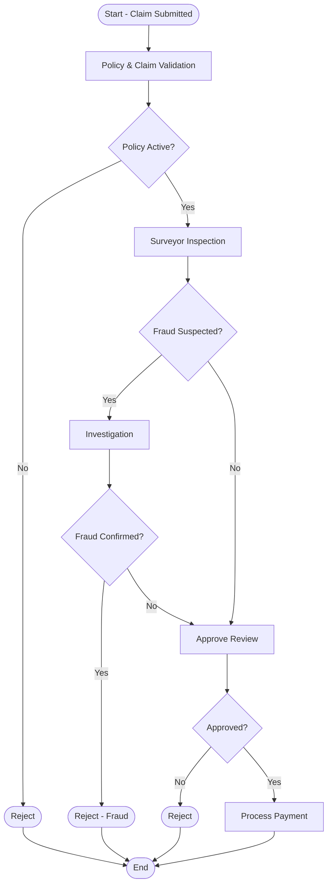
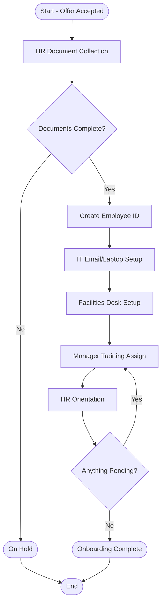
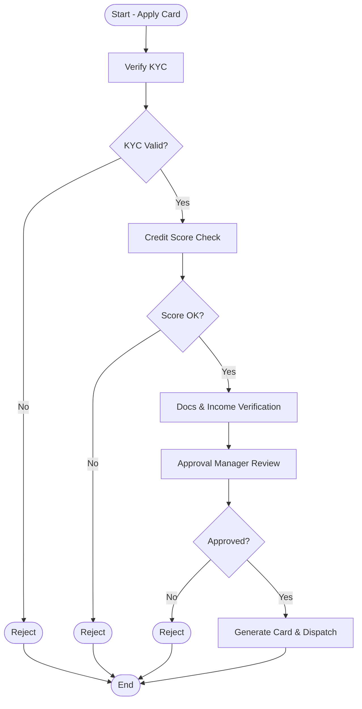
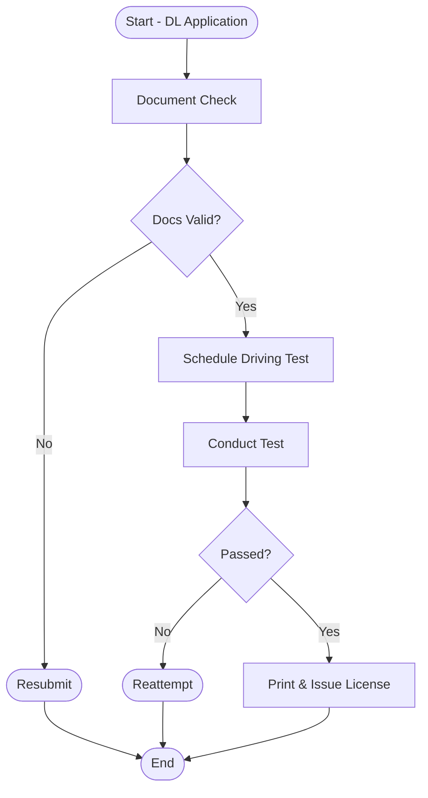
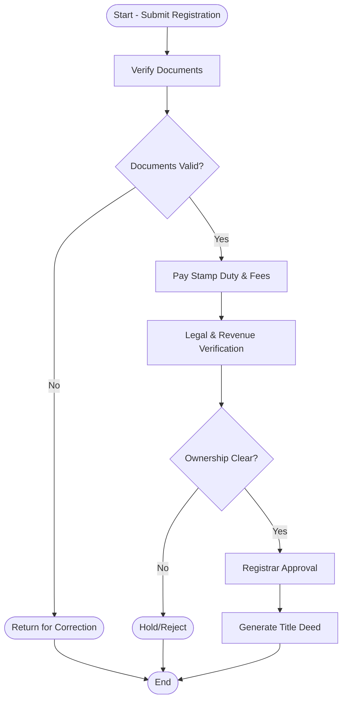
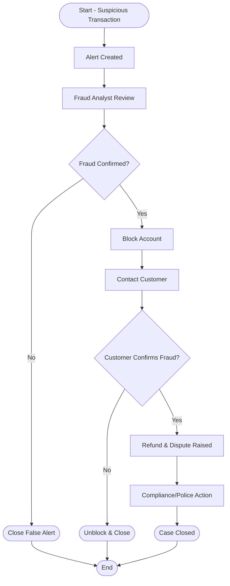

# 📌 Business Process Notes — Financial, Government & Corporate Domains  
**With Mermaid Workflow Diagrams**

---

## 🧠 Process Concepts & Terminology (BPM / FileNet PE)

**Process:**  
A set of tasks executed to achieve a business goal. Example: Loan approval.

**Workflow:**  
Automation of a business process where tasks move automatically between users based on rules.

**Task / Activity:**  
Single unit of work done by a human/system.

**Participant:**  
Users, groups, or systems that perform the tasks.

**Route / Transition:**  
Path of workflow between tasks, sometimes based on decisions.

**Decision Point:**  
Branching in workflow (example: Approved or Rejected).

**Process Goal:**  
Desired end state of the process.

**SLA / Deadlines:**  
Maximum time allowed to complete tasks.

**Queue / Workbasket:**  
Place where work items are assigned and picked up by users.

**Exception Flow:**  
Path followed when errors occur.

---

## ✅ Various Business Processes — Domain-wise

### Banking & Financial Domain
- Loan Approval
- Credit Card Issuance
- Fraud Detection Case Handling
- Insurance Claim Processing
- Account Opening
- High Value Funds Transfer Approval
- Mortgage Loan Processing

### Government Domain
- Passport Application
- Driving License Issuance
- Property Registration
- Birth Certificate Issue
- Grievance Case Handling

### Corporate / HR / Healthcare / Retail
- Employee Onboarding
- Patient Admission & Billing
- E-Commerce Order Fulfillment
- Customer Refund Handling

---

# 🏦 PROCESS 1: Loan Approval Process

**Goal:** Approve or reject a customer loan request.  
**Participants:** Applicant, Loan Officer, Risk Manager, Credit Team, System.

---

# 🏛️ PROCESS 2: Passport Application Process

**Goal:** Issue passport after verification.  
**Participants:** Applicant, Passport Office, Police Verification Team.

---

# 🛡️ PROCESS 3: Insurance Claim Handling

**Goal:** Approve/Reject insurance claim after risk verification.  
**Participants:** Customer, Surveyor, Analyst, Approval Manager.

---

# 🧑‍💼 PROCESS 4: Employee Onboarding

**Goal:** Make employee ready with all assets & access.  
**Participants:** HR, IT, Facilities, Manager.

---

# 💳 PROCESS 5: Credit Card Issuance

**Goal:** Issue card to eligible customer.  
**Participants:** Sales/Bank Staff, Verification Team, Credit Manager.

---

# 🚗 PROCESS 6: Driving License Issuance

**Goal:** Confirm citizen driving skill & issue DL.  
**Participants:** Citizen, RTA Office, Test Inspector.

---

# 🏘️ PROCESS 7: Property Registration

**Goal:** Legal registration of property title.  
**Participants:** Buyer, Registrar, Legal/Revenue Dept.

---

# 🔍 PROCESS 8: Fraud Detection Case Handling

**Goal:** Detect & act on suspicious transactions.  
**Participants:** Fraud Analyst, Customer, Compliance, Police.

---

