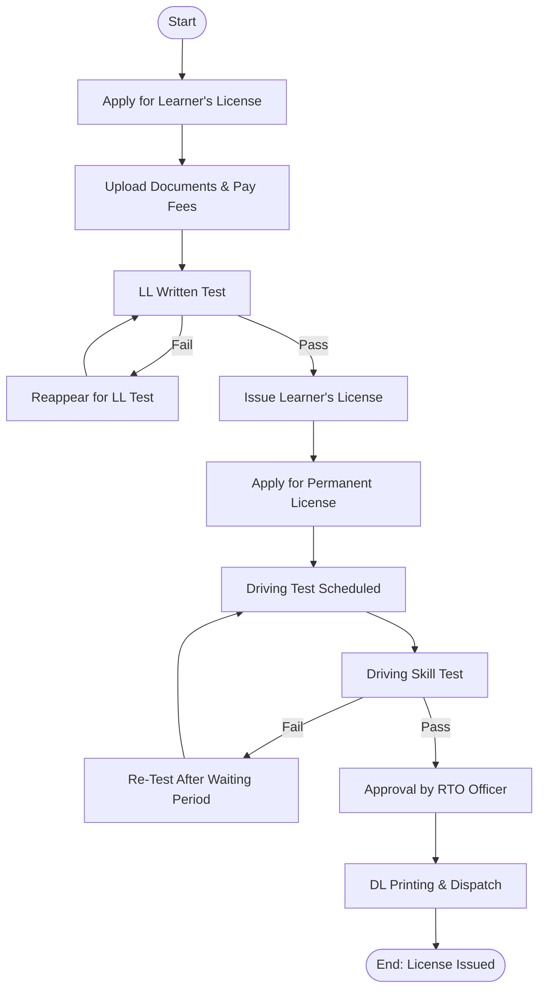

# 🚗 Driving License Issuance Process — Government Domain
✅ Process Overview

Driving License (DL) issuance is a regulated workflow where a citizen applies for a Learner’s License (LL), completes driving competency tests, and receives a Permanent Driving License upon approval.

🎯 Process Goal

To ensure only eligible and skilled drivers are legally permitted to drive vehicles on the road, maintaining road safety and compliance.

👥 Participants (Users / Roles)
Role | Responsibility
--- | ---
Applicant | Applies for LL/DL, submits documents, appears for tests
RTO Clerk | Basic verification of applicant documents
Driving Test Inspector | Conducts driving skill test
Licensing Authority / RTO Officer | Approves final license issuance
Printing & Dispatch Unit | Prints and delivers license

📌 Business Process Steps

- 1️⃣ Apply online/offline for Learner's License (LL)
- 2️⃣ Upload documents (ID, Age, Address proof)
- 3️⃣ Slot booking for LL test
- 4️⃣ Online/Offline Learning Test
- 5️⃣ LL Issued (valid for ~6 months)
- 6️⃣ Apply for Permanent Driving License
- 7️⃣ Slot booking for Driving Test
- 8️⃣ Road test by Inspector
- 9️⃣ Result Evaluation: Pass / Fail
- 🔟 If passed → Approval & DL Printing
- ✅ License delivered or downloadable as smart card

🔀 Decision Points & Routes
Decision | Route A | Route B
--- | --- | ---
LL Test Cleared? | Issue LL | Reappear for Test
Driving Test Passed? | Approve DL | Re-Test After Waiting Period
Documents Valid? | Continue Process | Reject Application

✅ Mermaid Flowchart — Driving License Issuance

🚗 Driving License Process – Step-by-Step
- Start
The journey begins when an individual decides to apply for a driving license.
- Apply for Learner's License (LL)
The applicant submits a request to get a learner’s license.
- Upload Documents & Pay Fees
Required documents are uploaded and the application fee is paid.
- LL Written Test
The applicant takes a written test to assess basic road rules and traffic signs.
- Fail → Must reappear for the test until passed
- Pass → Learner’s License is issued
- Apply for Permanent License (DL)
After holding the learner’s license for the required period, the applicant applies for a permanent license.
- Driving Test Scheduled
A date is set for the practical driving test.
- Driving Skill Test
The applicant demonstrates driving skills in front of an examiner.
- Fail → Must wait and reappear for the test
- Pass → Application moves forward
- Approval by RTO Officer
The Regional Transport Office (RTO) officer reviews and approves the application.
- DL Printing & Dispatch
The driving license is printed and dispatched to the applicant.
- End – License Issued
The applicant receives the official driving license.

Let me know if you'd like this turned into a visual diagram, a checklist for applicants, or a version for training or automation.

# 🌍 Real-Time Scenario (India Example)

Applicants apply via Parivahan portal (RTO online services)  
Computer-based test for LL  
Driving skill test in RTO ground  
Smart Card license dispatched by post or downloaded as Digilocker copy  

✅ Some states use AI-based Automated Driving Test Tracks for fair evaluation.

🛠️ Documents Required (Artifacts)

- Proof of Age (Birth Certificate / Aadhaar)
- Proof of Address (Utility Bills / Passport)
- Passport-size Photographs
- Medical Certificate (for commercial license)
- Test scores & approvals

🔗 Workflow Automation (BPM / FileNet Mapping)
Feature | Purpose
--- | ---
Routing to Queues | LL approval, driving test approval
Timer/SLA Events | Waiting periods for re-test
Document Management | Storing proofs and evaluation sheets
Audit Logs & Security | Regulated government process
External Integration | Aadhaar verification + Payment gateway
