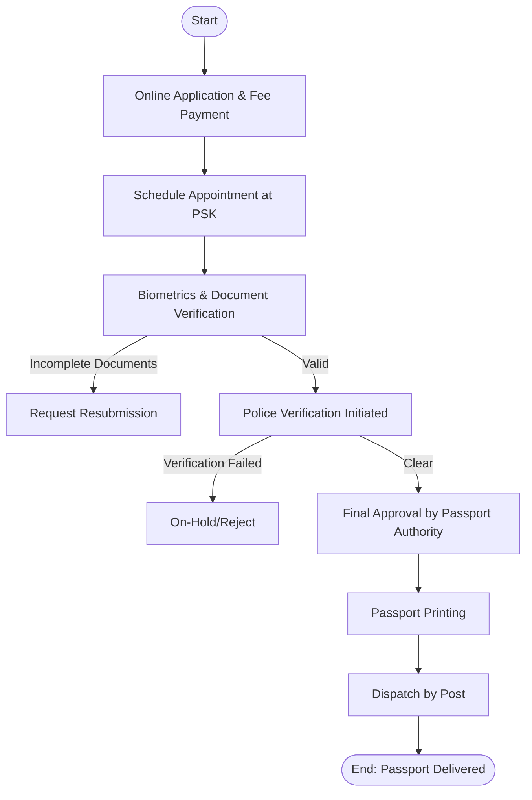

# 🛂 Passport Application Process — Government Domain

## ✅ Process Overview
A government-regulated workflow where an applicant submits required documents, completes biometrics/verification, and receives an issued passport after Police and Authority approvals.

## 🎯 Process Goal
To verify identity, nationality, and supporting documents to securely issue a passport with zero fraud.

## 👥 Participants (Users / Roles)
| Role | Responsibility |
|------|----------------|
| Applicant | Applies, submits documents, attends appointment |
| Verification Officer (PSK) | Document + biometric verification |
| Police Officer | Conducts background/personal verification |
| Passport Granting Officer (RPO) | Final approval |
| Printing & Dispatch Team | Passport printing & delivery |

## 📌 Business Process Steps
1️⃣ Online Application & Appointment Booking  
2️⃣ Upload and submission of identity/employment proofs  
3️⃣ Pay fees and schedule visit to Passport Office (PSK)  
4️⃣ Biometrics, document check & interview at PSK  
5️⃣ Police Verification (Home verification / records check)  
6️⃣ Decision: Approved or On-hold/Rejected  
7️⃣ Passport Printing  
8️⃣ Dispatch via India Post  
✅ Delivery to Applicant  

## 🔀 Decision Points / Routing
| Decision | Route A | Route B |
|---------|---------|---------|
| Documents Valid? | Proceed | Request Resubmission |
| Police Verification Clear? | Approve | Hold / Reject |
| High-risk Case? | Escalate to RPO | Continue Normal Flow |

## ✅ Mermaid Flowchart — Passport Application Process

## 🌍 Real-Time Example (India)
- Applicant books slot via Passport Seva Portal
- Biometric data (fingerprints & photo) captured at PSK
- Police conducts home verification
- Upon approval → Passport printed in centralized facility → Delivered through Speed Post
- ✅ Fast-track option: **Tatkal** (extra fees + tighter checks)

## 🛠️ Artifacts (Documents Stored)
- Birth/Identity Proof (Aadhaar, PAN)
- Address Proof (Ration Card, Utility Bill)
- Citizenship details
- Previous passport (if renewal)
- Police clearance report
- Approval logs

## 🔗 Workflow Automation (FileNet / IBM BPM)
| Feature | Usage |
|--------|------|
| Work Queues | Routing cases for Police / PSK Officer |
| SLA Timers | Escalations if verification delayed |
| Document Management | Store KYC docs securely |
| API Integration | With Police DB + Postal tracking |
| Audit Trails | Legal compliance & fraud control |
